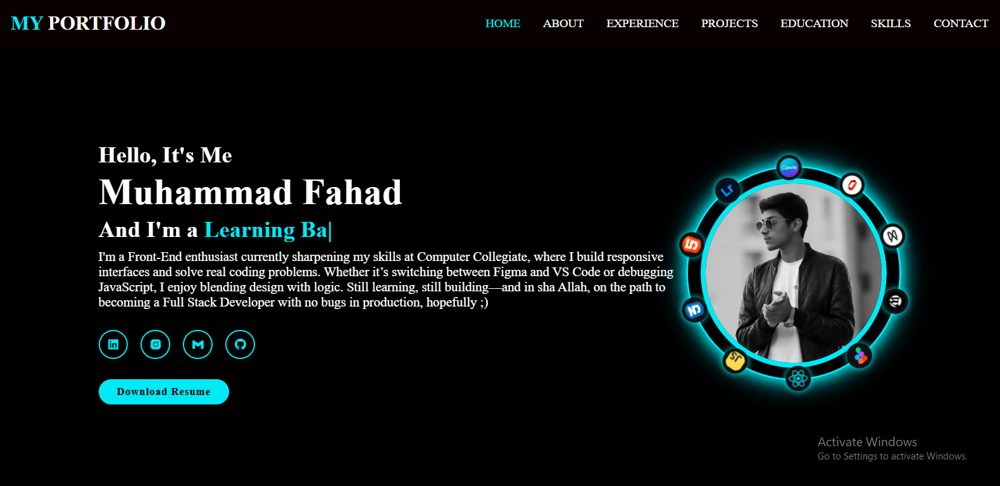
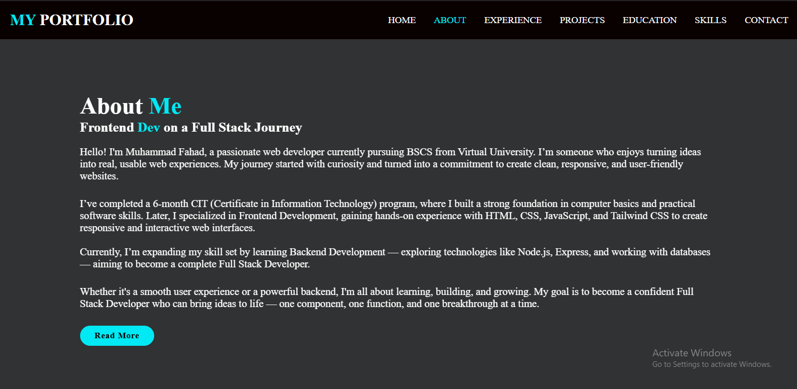
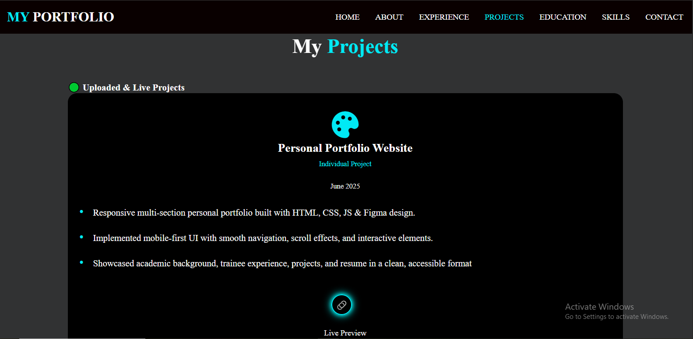
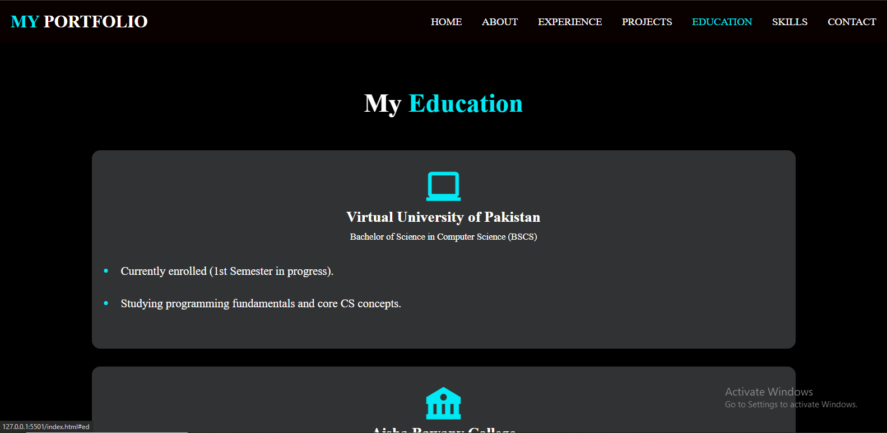
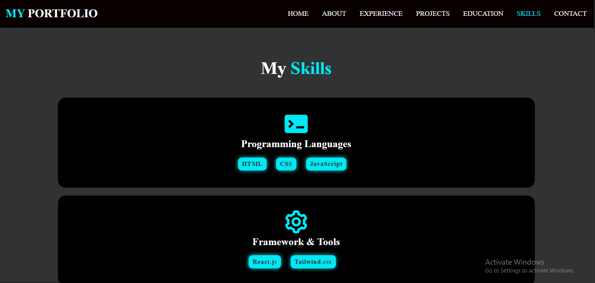
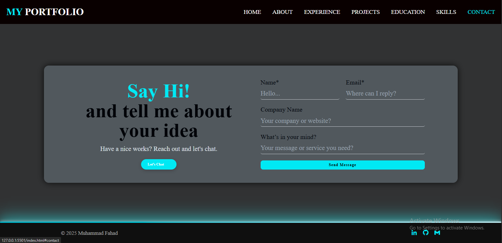
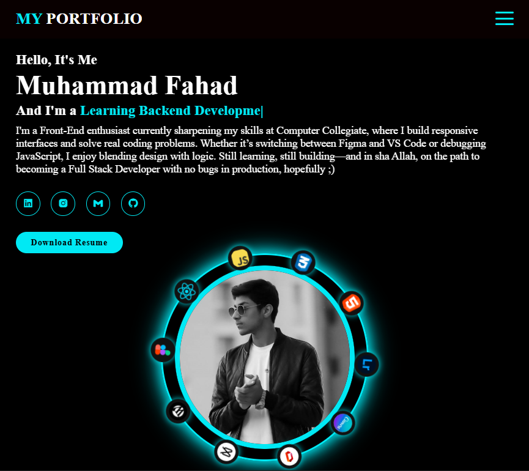
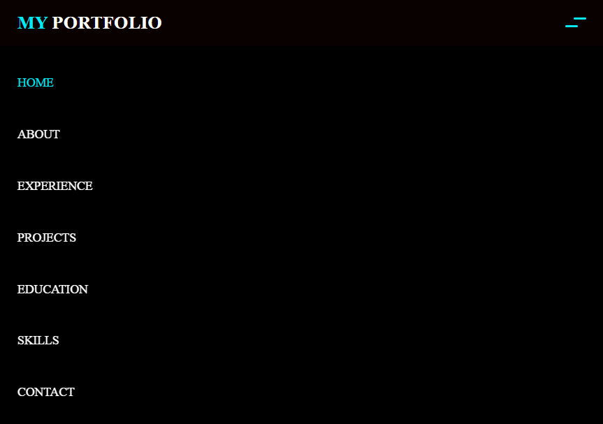

# 🌐 Fahad's Portfolio Website

Welcome to my personal portfolio website, a showcase of my front-end development skills, creative projects, and professional journey.

---

## 📌 About

This website serves as a digital resume and creative space where I share:

- My background and skills in HTML, CSS, JavaScript, and Tailwind CSS
- Real-world projects built during my learning and client work
- Contact form with email integration (Formspree)
- Custom transitions and animations for a polished experience
- Responsive design for mobile, tablet, and desktop

---

## 🚀 Features

- 💻 **Responsive Design** — Optimized across all screen sizes
- 🎨 **Modern UI/UX** — Smooth transitions and clean layout
- 📩 **Functional Contact Form** — Integrated with Formspree for email submissions
- 🌟 **Custom Thank You Page** — Includes star rating feature
- 🧠 **Animated Sections** — Entrance animations using pure CSS
- ⚙️ **Tailwind CSS + Custom Styles** — Built for performance and style

---

## 🔧 Technologies Used

- **HTML5**
- **CSS3**
- **Tailwind CSS**
- **JavaScript**
- **Formspree** (for contact form handling)
- **Google Fonts & Icons**

---

![Preview]

### 🏠 Home Page

### 🧾 About Section

### 🧾 Experience Section

### 🧾 Projects Section

### 🧾 Education Section

### 🧾 Skills Section

### 🧾 Contact Section

### 🧾 Thank-you Page
-sec-ss.png)
-sec-ss.png)

## Mobile View

### 🏠 Homepage

---

## 📁 Folder Structure

Fahad-Portfolio-Website/
│
├── index.html # Home page
├── thankyou.html # Custom thank-you page after form submission
├── css/
│ ├── style.css # Main styles
│ └── thankyou.css # Styles for the thank-you page
├── js/
│ └── Script.js # JavaScript for menu toggle, animations, etc.
├── Screenshots/ # Portfolio and UI images
├── README.md # You’re here!

---

## 📬 Contact Me

If you'd like to connect for collaboration, freelance, or internships:

- 📧 Email: [mfahadshahzad348@gmail.com]
- 🌍 Website: [www.fahadportfolio.com] (optional custom domain)
- 📱 WhatsApp: [+92 330 0247295](https://wa.me/923300247295)

---

## 📃 License

This project is for educational and professional portfolio purposes. You may reference the code with attribution, but please do not copy it entirely.

---

> Created with ❤️ by Muhammad Fahad
